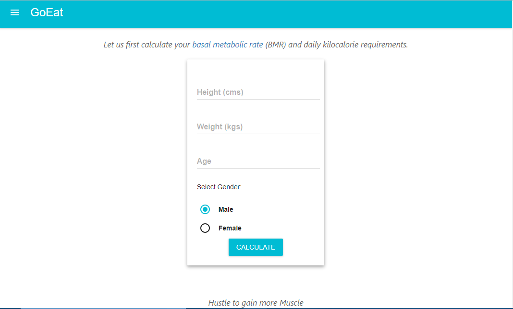
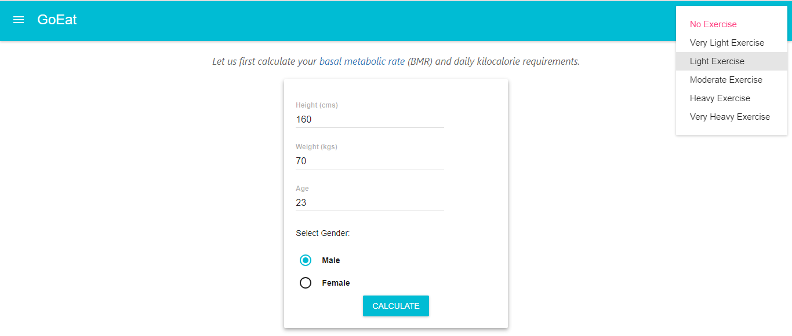
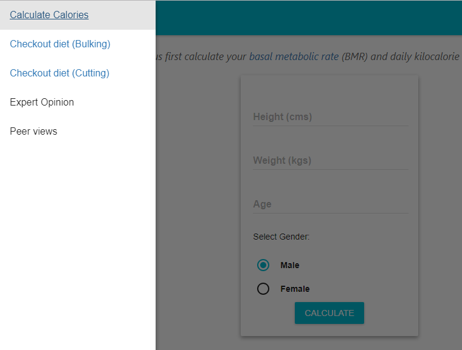
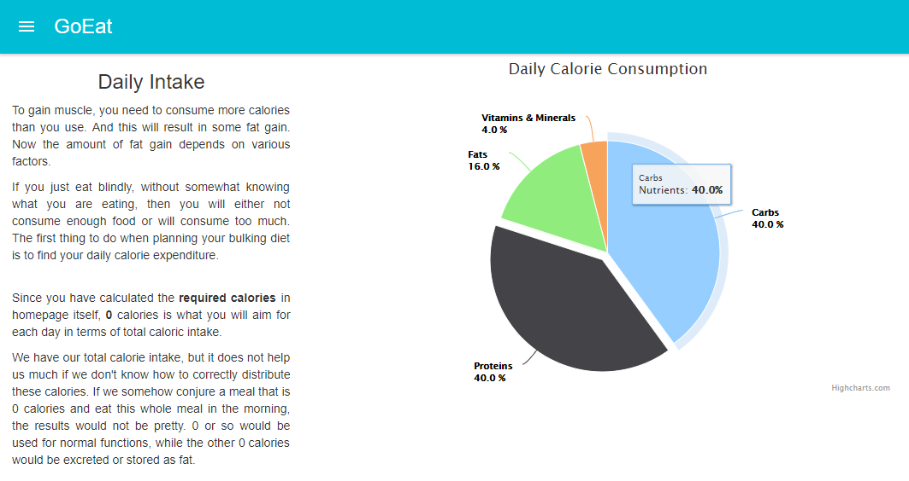
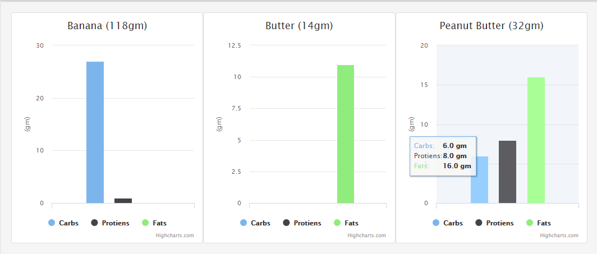

# Go Eat
An app to help people decide on what to eat when they are aiming at a strict workout schedule with promising outcomes. This app suits to people who are obese and want to be fit and healthy, and also people who are lean and want to be muscular.

---
## Usage
- The app takes the details of the person such as height, weight, gender etc to calculate the appropiate calorie intake the person should have based on daily activities ranging from _no exercise_ to _heavy exercise_

- It provides options on how you categorize your daily activities, ranging from _no exercise_ to _heavy exercise_

- You can choose on how you want your diet to be, Bulking (for lean and thin people) or Cutting (for obese people)

- We also provide a percentage breakup of your whole diet

- The three primary components of food **proteins**, **fats** and **carbohydrates**, are also analyzed for each food

---

This project was bootstrapped with [Create React App](https://github.com/facebookincubator/create-react-app).
